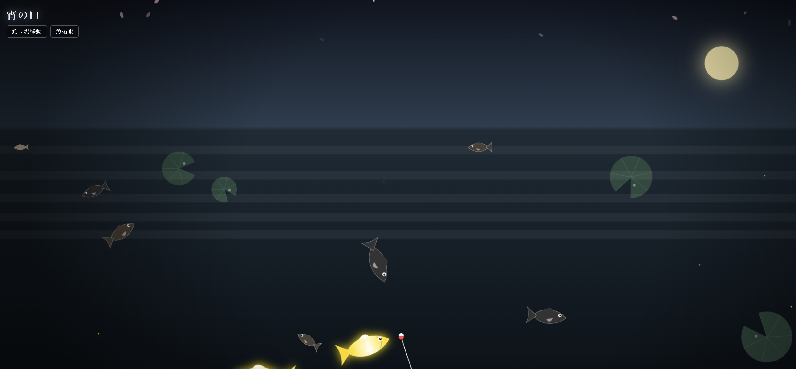

# Wa-Fishing (和釣り)

「和」をテーマにした、ブラウザで遊べるリラックスフィッシングゲーム。
美しい日本の風景の中で、様々な魚を釣り上げ、図鑑をコンプリートしましょう。



## 🎮 概要

Next.js と HTML5 Canvas で構築された、シンプルながらも趣のある釣りゲームです。
墨絵風のエフェクトや、四季折々の風景（河口、渓流、古池、縁日）を楽しみながら、釣り竿一本で大物を狙います。

## ✨ 特徴

- **「和」の美学**: 墨絵調のエフェクト、和紙風のUI、落ち着いたBGM（予定）が織りなす独特の世界観。
- **4つの個性的なステージ**:
  - **河口 (River Mouth)**: 夕暮れの都会の灯りと共に。スズキやクロダイが狙えます。
  - **渓流 (Mountain Stream)**: 苔むした岩場と流れる滝。イワナやヤマメなどの清流魚が生息。
  - **古池 (Old Pond)**: 静寂に包まれた池。巨大なコイやナマズ、伝説の魚も…？ (ヌシ)
  - **縁日 (Festival)**: 賑やかな屋台の灯り。金魚すくいのような感覚で楽しめます。
- **直感的な操作**: タップ/クリックだけで楽しめるシンプルな操作系。
  - タップしてキャスト（投げる）
  - 魚が食いついたらタイミングよくタップしてフッキング
  - 長押しでリールを巻く / 離して糸の緩急をつける
- **やり込み要素**: 釣った魚は自動的に記録され、コレクション要素として楽しめます。

## 🛠️ 技術スタック


- **Framework**: [Next.js](https://nextjs.org/) (React)
- **Language**: TypeScript
- **Styling**: Tailwind CSS
- **Graphics**: HTML5 Canvas API (Pure Canvas rendering for performant animations)
- **State Management**: Zustand (w/ Persistence)
- **Bundler**: Turbopack

## 🚀 開発の始め方

このプロジェクトは Dev Container 環境に対応しています。

1. リポジトリをクローンします。
2. 依存関係をインストールします:
   ```bash
   npm install
   ```
3. 開発サーバーを起動します:
   ```bash
   npm run dev
   ```
4. ブラウザで `http://localhost:3000` を開きます。

## 🕹️ 操作方法

1. **タイトル画面**: 画面をタップしてスタート。
2. **ステージ選択**: 上部のボタンから好きな釣り場へ移動できます。
3. **釣り**:
   - **キャスト**: 画面をタップするとウキを投げます（タップ位置が高いほど遠くへ飛びます）。
   - **ヒット待ち**: ウキが沈むのを待ちます。「引いている！」の表示が出たらタップ！
   - **ファイト**:
     - 画面を**長押し**するとリールを巻いて魚を寄せます。
     - 糸のテンションゲージが赤くなると切れそうになります。**指を離して**緩めましょう。
     - うまく調整して手元まで寄せれば釣り上げ成功です。

## 📄 ライセンス


MIT License
